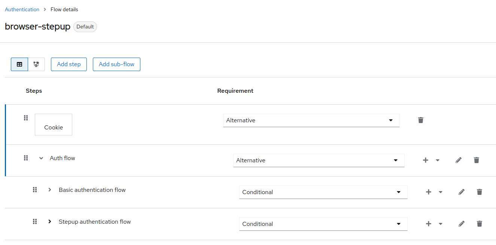
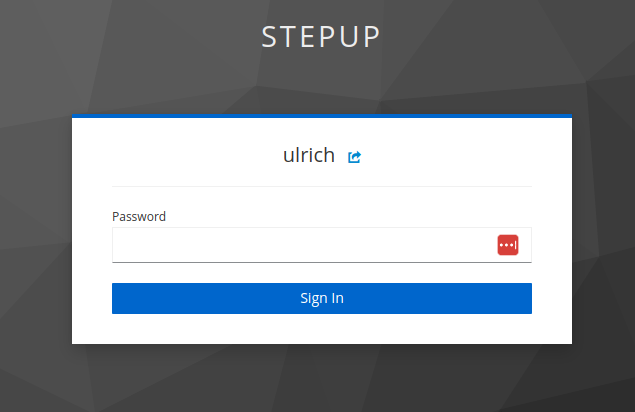
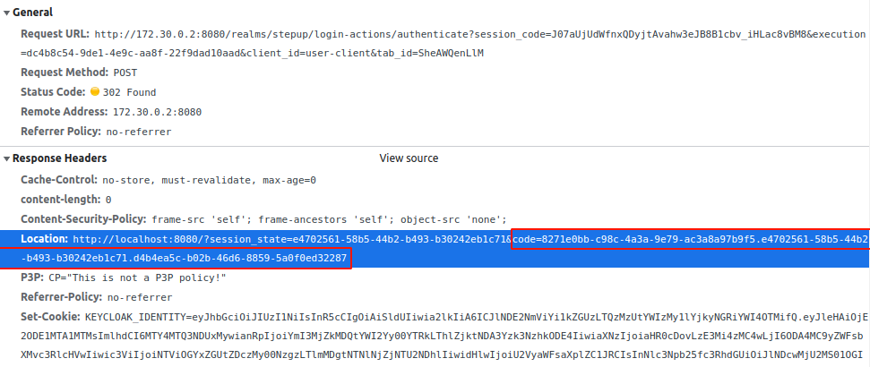
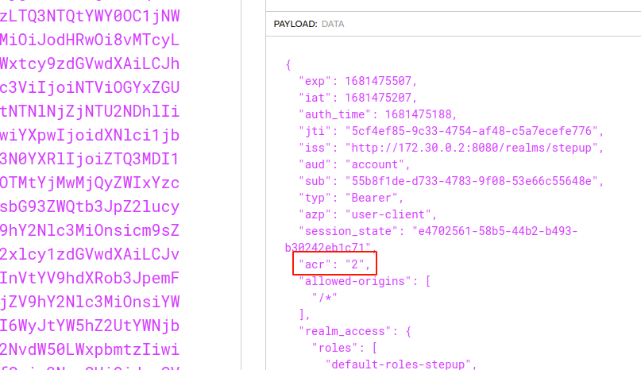

# Stepup Authentication With Keycloak and Spring Boot

## The quickstart

Add a simple Spring boot app with the convenience dependencies.

- The best way to generate a Ready-to-run application in Java is to use,
  the [Spring boot initializr](https://start.spring.io/).

By the way we need to enroll the following dependencies:

- Spring Web
- Spring Security
- OAuth2 Client
- OAuth2 Server
- Lombok
- Testcontainers

The followings for this introduction will use Java 17 and Maven (of course).

### The minimum implementation

The reader should accept that this app doesn't fill the best practice expected for the Production environment.

## Plug the backend to Keycloak

Obviously, we will use Docker and Compose to lead this tutorial.

### Create the Docker Compose stack

- Add the Dockerfile for the backend app.

Nothing to new for this Dockerfile, we just need to separate the build stage from the runtime stage.

```dockerfile
# Build Container
FROM maven:3.8.5-openjdk-17-slim as build

WORKDIR /app/

RUN apt-get update && \
	  apt-get install -y --no-install-recommends

COPY pom.xml .
COPY /src src

RUN mvn clean package -DskipTests

# Run Container
FROM amazoncorretto:17

COPY --from=build /app/target/**.jar app.jar
```

- Add the Docker Compose services

Like the previous Docker configuration the Compose file is a-by-the-book example used to run the services:

```yaml
services:
  keycloak:
    image: quay.io/keycloak/keycloak:21.0
    ports:
      - 9080:8080
    networks:
      - keycloak-net
    volumes:
      - ./keycloak/config:/opt/keycloak/data/import
    environment:
      KEYCLOAK_ADMIN: admin
      KEYCLOAK_ADMIN_PASSWORD: admin
      KC_HOSTNAME: localhost
    entrypoint: [ "/opt/keycloak/bin/kc.sh", "start-dev", "--import-realm" ]
  backend:
    depends_on:
      - keycloak
    build: ./backend
    ports:
      - 8080:8080
    networks:
      - keycloak-net
    entrypoint: [ "java", "-Xms512m", "-Xmx1g", "-jar", "app.jar", "--debug" ]

networks:
  keycloak-net: { }
```

- Resolve the Keycloak hostname in your local hosts file for Keycloak

```shell
❯ docker inspect -f '{{range .NetworkSettings.Networks}}{{.IPAddress}}{{end}}' stepup-keycloak
172.22.0.2
❯ cat /etc/hosts
172.22.0.2	stepup-keycloak
```
- 
- Resolve the Keycloak hostname in your local hosts file for the backend

```shell
❯ docker inspect -f '{{range .NetworkSettings.Networks}}{{.IPAddress}}{{end}}' stepup-backend
172.22.0.3
❯ cat /etc/hosts
172.22.0.3	stepup-backend
```

### Create the Keycloak the stepped-up configuration realm

The detailed configuration can be found in this the [keycloak/config/realm.json](../keycloak/config/stepup-realm.json)
file, but we can highlight some points:

- The client `user-client` is mandated for delivering an `access token` to the user,
- The frontend-url property has necessary to be set to http://172.30.0.2:8080 for the issuer claim value.

### Create the OAuth2 security layer

Backend side we can use a simple but an effective configuration where the settings are spread both in
the `application.yml` and `SecurityConfiguration.java` files. No more needed for the time.

The following shows the main content of the files:

- In the `application.yml` file we need to declare to Spring Security where the OIDC configuration can be found.

```yaml
spring:
  security:
    oauth2:
      resourceserver:
        jwt:
          client-id: user-client
          issuer-uri: http://stepup-keycloak:8080/realms/stepup
          jwk-set-uri: http://stepup-keycloak:8080/realms/stepup/protocol/openid-connect/certs
```

- In the `SecurityConfiguration.java` file we need to describe a basic configuration indicates how to handle the
  request.

```java

@Configuration
@EnableWebSecurity
@EnableMethodSecurity
class SecurityConfiguration {

    // ...

    @Bean
    public SecurityFilterChain filterChain(HttpSecurity http) throws Exception {
        http.cors();
        http.csrf().disable();
        http.authorizeHttpRequests()
                .anyRequest().authenticated()
                .and()
                .oauth2ResourceServer().jwt();

        return http.build();
    }
}
```

### Test the security configuration

At this point we can run the Compose stack:

```shell
❯ docker compose up --build
```

To be note that the client secret was generated during this documentation and located in the `stepup-realm.json` file.

Open a terminal and test the configuration.

- Get a valid access token from Keycloak

```shell
❯ TOKEN=`curl -XPOST 'http://stepup-keycloak:8080/realms/stepup/protocol/openid-connect/token' \
        --header 'Content-Type: application/x-www-form-urlencoded' \
        --data-urlencode 'client_secret=6AurffbSrQ4yaGOl2TE7nvdveKwM2CB0' \
        --data-urlencode 'client_id=user-client' \
        --data-urlencode 'grant_type=password' \
        --data-urlencode 'username=ulrich' \
        --data-urlencode 'password=ulrich' | jq -r .access_token`
```

- Test an authenticated access

```shell
❯ curl -i "http://stepup-backend:8080/user?email=foo@gmail.com" \
        --header "Authorization: Bearer $TOKEN"
```

- The expected result from the previous request should be:

```shell
HTTP/1.1 200 
Vary: Origin
Vary: Access-Control-Request-Method
Vary: Access-Control-Request-Headers
X-Content-Type-Options: nosniff
X-XSS-Protection: 0
Cache-Control: no-cache, no-store, max-age=0, must-revalidate
Pragma: no-cache
Expires: 0
X-Frame-Options: DENY
Content-Type: application/json
Transfer-Encoding: chunked
Date: Mon, 10 Apr 2023 16:35:48 GMT

{"email":"foo@gmail.com"}                                         
```

If we omit the `Authorization` header we should have this kind of response:

```shell
HTTP/1.1 401 
Vary: Origin
Vary: Access-Control-Request-Method
Vary: Access-Control-Request-Headers
Set-Cookie: JSESSIONID=21C630C8B2B38333DC81029DEBC2818E; Path=/; HttpOnly
WWW-Authenticate: Bearer
X-Content-Type-Options: nosniff
X-XSS-Protection: 0
Cache-Control: no-cache, no-store, max-age=0, must-revalidate
Pragma: no-cache
Expires: 0
X-Frame-Options: DENY
Content-Length: 0
Date: Mon, 10 Apr 2023 19:54:26 GMT
```

## The step-up implementation from app side

It's time to add more securities in our app by using a step-up mechanism involve the add of a request interceptor. The
request interceptor will should be triggered if any resource is marked by **@StepupAuthentication** annotation.

### The step-up components

No caveat in the current implementation based on Spring, we just need to develop three components:

- `StepupAuthentication.java` is the class that we will put on a stepped-up resource,
- `StepupAuthenticationInterceptor.java` is the implementation of the step-up mechanism. It is responsible for the ACR
  validation by opening the jwt-token and check if the signed token contains the expected LOA value,
- `StepupAuthenticationInterceptorConfig.java` is the underlying code responsible to declare own interceptor.

### The resource security enhancement

All is ready to enhance the security and for the test we will put the `@StepupAuthentication` on
the `UserResource.delete` resource.

Just like that:

```java

@RestController
@RequestMapping(
        value = "user",
        produces = {"application/json"})
public class UserResource {

    private final UserRepository userRepository;

    @Autowired
    public UserResource(UserRepository userRepository) {
        this.userRepository = userRepository;
    }

    // ...

    @DeleteMapping
    @StepupAuthentication
    public ResponseEntity<Void> delete(@RequestParam String email) {
        userRepository.deleteUserByEmail(email);

        return new ResponseEntity<>(HttpStatus.NO_CONTENT);
    }
}
```

## The step-up implementation from Keycloak side

The Keycloak instance is ready to test in this tutorial, but we will brief take a look in the authentication flow where
all work.

### The overridden Browser flow

The basic Browser flow doesn't allow to build a stepped-up flow, so I created the `browser-stepup-flow` cloned from
the `browser-flow`. More details are available in the Keycloak configuration but just note the two flows, the first one
for the default flow and the second for the step-up flow.

The key here is that the user pass through with success the `Stepup authentication flow` the ACR field will contain the
expected LOA value (2 for my example).

Remember, if the stepup authentication interceptor validates the ACR code, it will let the execution continue.



### Test the step-up configuration

Open a terminal and test the configuration.

- Get a valid access token from Keycloak

```shell
❯ TOKEN=`curl -XPOST 'http://stepup-keycloak:8080/realms/stepup/protocol/openid-connect/token' \
        --header 'Content-Type: application/x-www-form-urlencoded' \
        --data-urlencode 'client_secret=6AurffbSrQ4yaGOl2TE7nvdveKwM2CB0' \
        --data-urlencode 'client_id=user-client' \
        --data-urlencode 'grant_type=password' \
        --data-urlencode 'username=ulrich' \
        --data-urlencode 'password=ulrich' | jq -r .access_token`
```

#### Step 1

- Call the delete user resource

```shell
❯ curl -i -XDELETE "http://stepup-backend:8080/user?email=foo@gmail.com" \
        --header "Referer: http://localhost:8080" \
        --header "Authorization: Bearer $TOKEN"
```

- The expected result from the previous request should be:

```shell
HTTP/1.1 412 
Vary: Origin
Vary: Access-Control-Request-Method
Vary: Access-Control-Request-Headers
X-Content-Type-Options: nosniff
X-XSS-Protection: 0
Cache-Control: no-cache, no-store, max-age=0, must-revalidate
Pragma: no-cache
Expires: 0
X-Frame-Options: DENY
Content-Type: application/json
Content-Length: 253
Date: Fri, 14 Apr 2023 12:02:51 GMT

{"status":"PRECONDITION_FAILED","authenticationUrl":"http://stepup-keycloak:8080/realms/stepup/protocol/openid-connect/auth?client_id=user-client&redirect_uri=http%3A%2F%2Flocalhost%3A8080%2F&response_type=code&response_mode=query&scope=openid&acr_values=2"}
```

Explanations:

- This response status available in the `status` field means that the LOA (Level Of Access) value stored in ACR claim
  field was not in the good level,
- The step-up mechanism built a validation URL for the end user available in the `authenticationUrl` field.

#### Step 2

To continue the authentication flow, the user needs to follow the given URL and provides to good password.



If the password form is successfully passed, the Keycloak forwards the flow by using the given URI located in
the `redirect_uri` URL parameter.



#### Step 3

At this moment, the app needs to exchange the `authorization-code` (located in the response header Location) for
the `access-token`. This is the final step where the app will receive the `access-token` filled with the expected ACR claim value (2).

Proceed to get the new access-token.

```shell
TOKEN=`curl -XPOST 'http://stepup-keycloak:8080/realms/stepup/protocol/openid-connect/token' \
        --header 'Content-Type: application/x-www-form-urlencoded' \
        --data-urlencode 'grant_type=authorization_code' \
        --data-urlencode 'client_id=user-client' \
        --data-urlencode 'client_secret=6AurffbSrQ4yaGOl2TE7nvdveKwM2CB0' \
        --data-urlencode 'code=3125c7c3-b2a9-4c20-a2dd-e5bb14b16b6b.e4702561-58b5-44b2-b493-b30242eb1c71.d4b4ea5c-b02b-46d6-8859-5a0f0ed32287' \
        --data-urlencode 'redirect_uri=http://localhost:8080/' | jq -r .access_token`
```

- The expected result from the previous request should be a new access-token with the ACR claim field updated:



#### Step 4

It's now possible to call the protected resources with the good level of accreditation.

```shell
❯ curl -i -XDELETE "http://stepup-backend:8080/user?email=foo@gmail.com" \
        --header "Referer: http://localhost:8080" \
        --header "Authorization: Bearer $TOKEN"
```

- The expected result from the previous request should be:

```shell
HTTP/1.1 204 
Vary: Origin
Vary: Access-Control-Request-Method
Vary: Access-Control-Request-Headers
X-Content-Type-Options: nosniff
X-XSS-Protection: 0
Cache-Control: no-cache, no-store, max-age=0, must-revalidate
Pragma: no-cache
Expires: 0
X-Frame-Options: DENY
Date: Fri, 14 Apr 2023 12:34:41 GMT
```

The status code of the delete user action is 204.